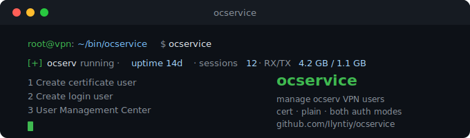
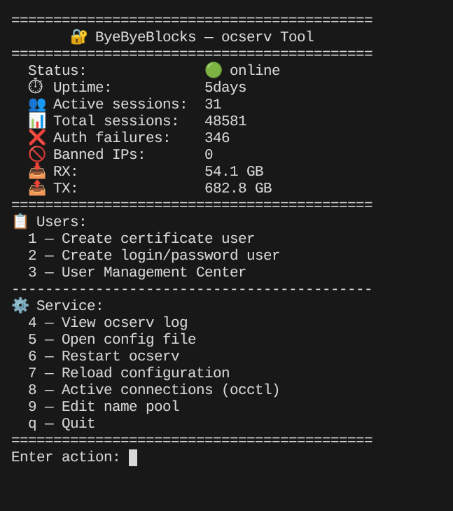
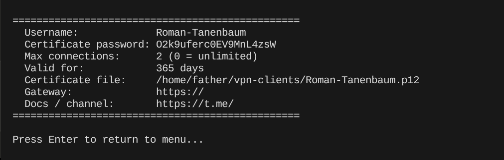
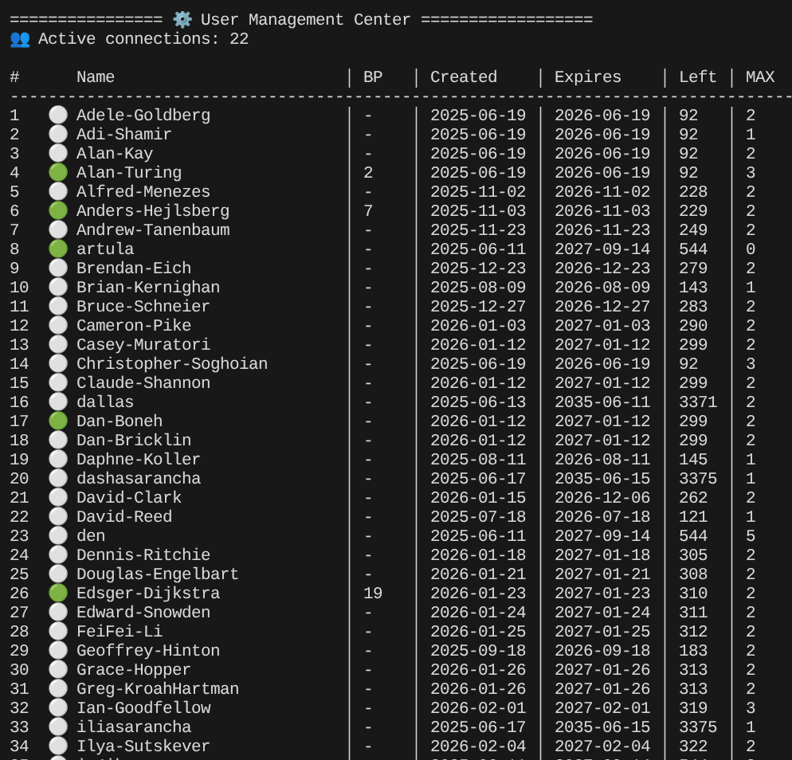
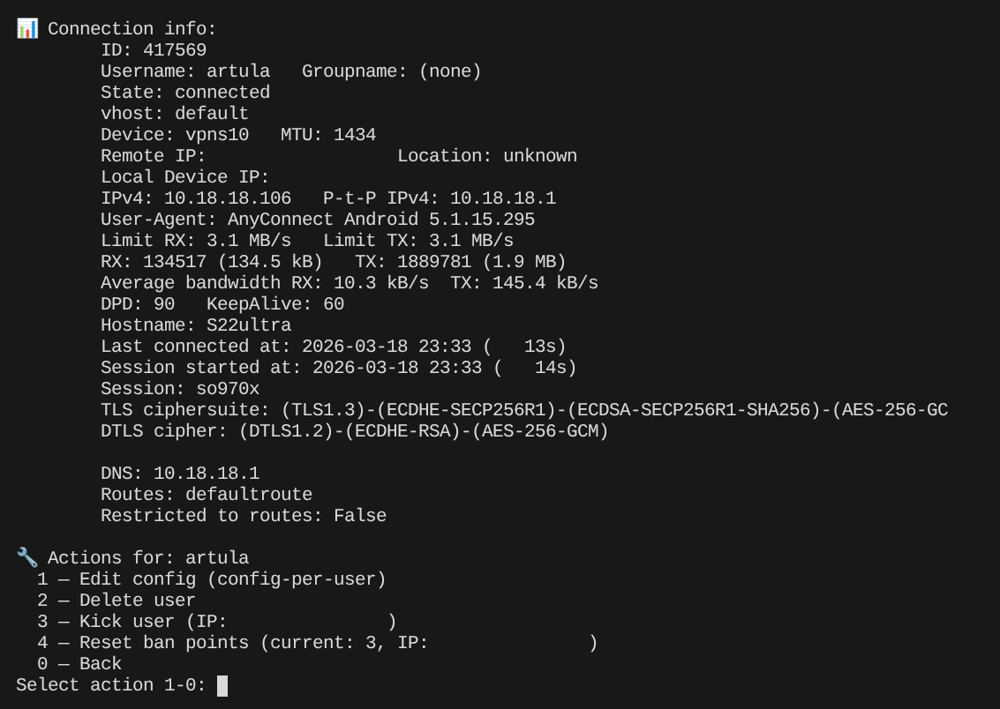

# ocservice

A set of bash scripts for managing [ocserv](https://ocserv.openconnect-vpn.net/) — the OpenConnect VPN server. Designed for servers where ocserv is built from source and installed to a custom prefix, and [easy-rsa](https://github.com/OpenVPN/easy-rsa) is used for certificate management.



## Features

- Create certificate-based VPN users (easy-rsa + .p12 export)
- Create login/password VPN users
- User Management Center — view all users, certificate expiry, ban points, online status
- Kick users and reset ban points
- Server status block in the main menu (uptime, sessions, RX/TX)
- Supports `cert`, `plain` and `both` authentication modes
- Camouflage URL auto-detected from `ocserv.conf` during install (port included if non-standard)
- Username pool — auto-generate unique names from a customizable list
- Per-user `config-per-user` file created automatically with a commented settings template
- Certificate date cache — User Management Center loads instantly regardless of user count

---

## Requirements

- ocserv built from source (any recent version)
- [easy-rsa](https://github.com/OpenVPN/easy-rsa) 3.x (for certificate users)
- openssl
- `use-occtl = true` in `ocserv.conf`

---

## Quick start

```bash
git clone https://github.com/Ilyntiy/ocservice.git
cd ocservice
chmod +x install.sh
sudo ./install.sh
```

`install.sh` will:
- Parse paths from your existing `ocserv.conf`
- Ask a few questions (prefix, auth mode, server address)
- Generate `ocservice.conf` in the install directory
- Copy scripts to `~/bin/ocservice/` (or your chosen location)
- Create a symlink at `/usr/local/bin/ocservice`
- Set up file permissions and create required directories
- Create `/etc/sudoers.d/ocservice` with minimal required permissions

After installation, run:

```bash
ocservice
```

---

## Updating

Pull the latest version and re-run the installer:

```bash
git pull
sudo ./install.sh
```

`install.sh` automatically detects an existing installation via the `/usr/local/bin/ocservice` symlink. If found, it skips all configuration questions and goes straight to updating the scripts.

What happens during update:
- Scripts are always overwritten
- `ocservice.conf` is patched — only new parameters are added, existing values are preserved
- Name pool, issued names log, certificate cache and user history are never touched

---

## Scripts

### `ocservice`
Main menu. Shows server status on every screen and provides access to all other scripts.

### `gen-client`
Creates a certificate-based VPN user. Generates an easy-rsa client certificate, exports it as a `.p12` file, and writes the result to the user history log.

Prompts:
- Username (pick from pool or enter manually)
- Certificate validity in days (default: 365)
- Max simultaneous connections (0 = unlimited)

A `config-per-user` file is created automatically for each new user with a commented template of available per-user settings (static IP, bandwidth limits, timeouts, etc.).



### `gen-login`
Creates a login/password VPN user via `ocpasswd`. Only available when `AUTH_MODE=plain` or `AUTH_MODE=both`.

Prompts:
- Username (pick from pool or enter manually)
- Max simultaneous connections (0 = unlimited)

A `config-per-user` file is created automatically for each new user.

### `ocnames`
Shared helper sourced by `gen-client` and `gen-login`. Handles username selection — picks a random available name from the pool or falls back to manual entry. Tracks issued names in `names_used` and detects duplicates across certificates and `ocpasswd`.

### `user-center`
Lists all users with their status, certificate dates, ban points and connection limit. Allows you to view connection details, edit `config-per-user`, kick, unban or delete a user.

Use `r — Rebuild certificate cache` to reinitialize the certificate date cache. This is required after the first install if you already had certificate users, or if you ever create or revoke certificates outside of ocservice.





---

## Configuration

All settings live in `ocservice.conf`, placed in the same directory as the scripts.

| Variable | Description |
|---|---|
| `OCSERV_PREFIX` | ocserv installation prefix (passed to `--prefix` at build time) |
| `EASYRSA_DIR` | Path to easy-rsa directory |
| `VPN_CLIENTS_DIR` | Where generated `.p12` files are stored |
| `AUTH_MODE` | `cert`, `plain` or `both` |
| `USER_FILE` | Path to `ocpasswd` file |
| `CONFIG_PER_USER` | Path to `config-per-user` directory |
| `OCSERV_CONF` | Path to `ocserv.conf` |
| `USER_HISTORY` | Path to user action log |
| `PASSWORD_LENGTH` | Length of auto-generated passwords (default: 20) |
| `SERVER_NAME` | Display name, also used as CA name in `.p12` certificates |
| `SERVER_URL` | Gateway URL shown to new users (include camouflage path if enabled) |
| `DOCS_URL` | Optional link to docs or Telegram channel |
| `NAMES_ENABLED` | `yes` to enable username pool, `no` to always prompt manually |
| `NAMES_FILE` | Path to the name pool file |
| `NAMES_USED_FILE` | Path to the issued names log (managed automatically) |
| `CERT_CACHE_FILE` | Path to the certificate date cache (managed automatically) |

See `ocservice.conf.example` for a fully commented template.

---

## Notes

### restart vs reload

Some `ocserv.conf` directives only take effect after a full restart (`systemctl restart ocserv`). These include `auth`, `enable-auth`, TCP/UDP ports and server certificates.

Use **Reload configuration** (menu item 7) for runtime changes: routes, DNS, timeouts, ban settings. Use **Restart ocserv** (menu item 6) after changing authentication or network settings.

### CA password

If your easy-rsa CA was created with a password, you will be prompted to enter it each time a certificate is created or revoked. This is expected behavior — ocservice does not store or bypass the CA password.

### AUTH_MODE

`AUTH_MODE` in `ocservice.conf` must match what is actually configured in `ocserv.conf`:

| `AUTH_MODE` | `ocserv.conf` |
|---|---|
| `cert` | `auth = "certificate"` |
| `plain` | `auth = "plain[passwd=...]"` |
| `both` | `auth = "plain[passwd=...]"` + `enable-auth = "certificate"` |

Setting `AUTH_MODE` incorrectly will hide menu items or show errors when creating users.

### Certificate cache

User Management Center reads certificate dates from a local cache file (`cert_cache`) instead of calling `openssl` for every user on each open. The cache is updated automatically when you create or delete users through ocservice.

If you ever create or revoke certificates manually (outside of ocservice), run `r — Rebuild certificate cache` in User Management Center to bring the cache back in sync.

### CRL

The certificate revocation list is read directly from `easy-rsa/pki/crl.pem`. Make sure `ocserv.conf` points to the same path:

```
crl = /home/user/easy-rsa/pki/crl.pem
```

---

## Uninstall

```bash
rm -rf <install_dir>
sudo rm /usr/local/bin/ocservice
sudo rm /etc/sudoers.d/ocservice
```

Replace `<install_dir>` with your actual install path (default: `~/bin/ocservice`).
