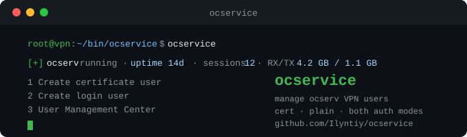
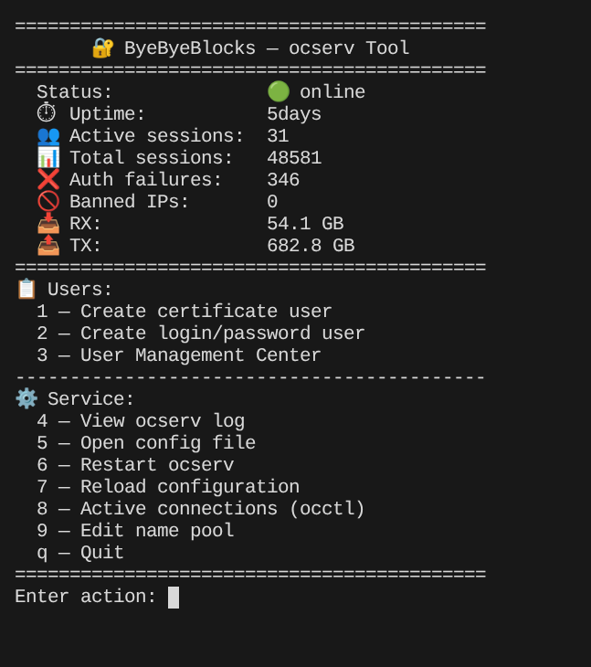
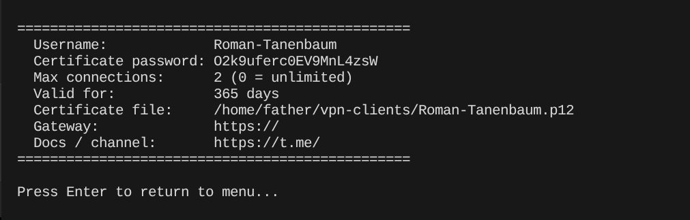
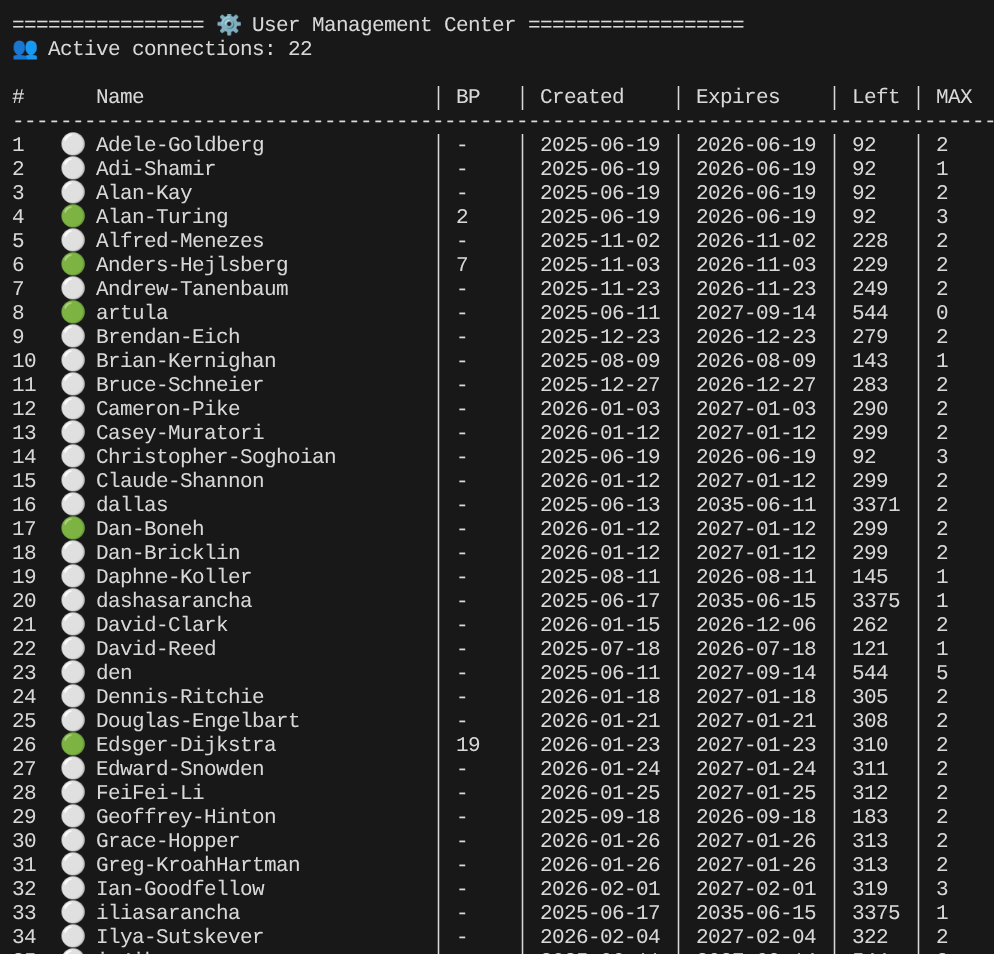
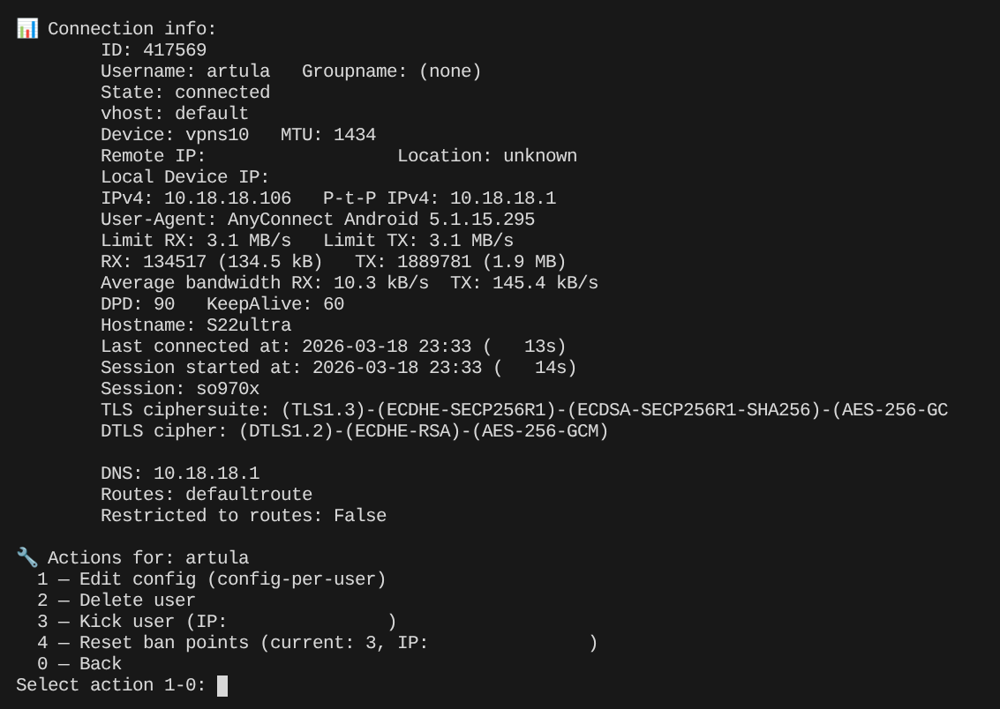

<p align="center">
  
</p>

# ocservice

A set of bash scripts for managing [ocserv](https://ocserv.openconnect-vpn.net/) — the OpenConnect VPN server — with [easy-rsa](https://github.com/OpenVPN/easy-rsa) certificate management. Works with ocserv built from source or installed from a distribution package.

## Features

- Create certificate users (easy-rsa + .p12 export) and login/password users
- User Management Center — all users, certificate expiry, ban points, online status
- Kick with session invalidation (ocserv 1.4.2+), reset ban points, delete with immediate revocation
- Status block — uptime, sessions, RX/TX, CPU load, memory, server certificate and CRL expiry with color indicators
- `cert`, `plain` and `both` authentication modes, auto-detected from `ocserv.conf`
- Gateway URL with camouflage secret and non-standard port detected from `ocserv.conf` during install
- Username pool, per-user `config-per-user` template, certificate date cache
- Least-privilege sudo; client private keys are not kept on the server

---

## Requirements

- Linux with systemd and GNU coreutils (Debian, Ubuntu, RHEL/Alma/Rocky, Fedora, Arch, openSUSE)
- ocserv in a **root-owned** prefix — built from source (e.g. `/opt/ocserv`) or a distribution package (`/usr`) — with `use-occtl = true`
- `sudo` or `sudo-rs`
- [easy-rsa](https://github.com/OpenVPN/easy-rsa) 3.x (for certificate users)
- OpenSSL 1.1 or 3.x

Tested on Ubuntu 26.04 LTS (sudo-rs), ocserv 1.5.0, easy-rsa 3.2.7.

## Recommended layout

| What | Where | Owner |
|---|---|---|
| ocserv binaries | `/opt/ocserv` (source build) or `/usr` (package) | root |
| `ocserv.conf`, `ca.crt` | `/etc/ocserv/` | root |
| CRL | `crl = /home/<admin>/easy-rsa/pki/crl.pem` | admin |
| Per-user configs | `config-per-user = /etc/ocserv/config-per-user` | admin |
| Password file (`plain` / `both`) | `/etc/ocserv/ocpasswd.d/ocpasswd` — alone in its directory | admin |
| easy-rsa | `~/easy-rsa` | admin |

*admin* is the regular user who runs ocservice. ocserv runs as root, so nothing it executes or reads as configuration may be writable by that user — the installer checks this.

---

## Quick start

```bash
git clone https://github.com/Ilyntiy/ocservice.git
cd ocservice
sudo ./install.sh
```

Run it with `sudo` from your admin account, not as root. The installer:
- detects `ocserv.conf`, the ocserv prefix and the auth mode from the systemd unit and `ocserv.conf`
- verifies that every binary granted via sudo is root-owned along its whole path, and refuses to install otherwise
- writes `ocservice.conf`, installs the scripts to `~/bin/ocservice/` and links `/usr/local/bin/ocservice`
- generates and validates `/etc/sudoers.d/ocservice`
- adds the admin to `systemd-journal` for log access (log out and back in once)

Then run:

```bash
ocservice
```

---

## Security model

ocservice runs as the admin user. Root is used only through these sudo rules:

| Rule | Used for |
|---|---|
| `occtl -n show status`, `show users`, `show user *`, `show ip ban points` | status, connections, user details |
| `occtl -n disconnect user *`, `terminate user *`, `unban ip *`, `reload` | kick, unban, reload |
| `systemctl restart ocserv` | restart |
| `openssl x509 -enddate …` / `openssl crl -nextupdate …` for the exact server certificate and CRL paths | expiry dates — added only if the file is not readable by the admin |
| `sudoedit <ocserv.conf>` | editing the config — **asks for your password** |

- `occtl` is always called with `-n` (no pager): a pager started as root can spawn a root shell.
- Editing `ocserv.conf` is equivalent to root access (`connect-script`), so it is never passwordless.
- Logs are read through `systemd-journal` group membership, not sudo.
- The client private key is deleted right after the `.p12` export — the certificate alone is enough for revocation. `.p12` files are stored with mode 600 in a 700 directory.
- `.p12` passwords are passed to OpenSSL through the environment, not the command line.

---

## Updating

```bash
git pull
sudo ./install.sh
```

An existing installation is detected via `/usr/local/bin/ocservice`. The installer re-runs all checks, overwrites the scripts, regenerates `ocservice.conf` keeping your values (the previous file is saved as `ocservice.conf.bak`) and rewrites the sudoers file. Name pool, issued names, certificate cache and user history are kept.

### From 1.2.x

1.3.0 is a security release and enforces a safe layout. The installer stops with instructions if:
- ocserv is installed under a user-writable prefix such as `~/ocserv` — move it to a root-owned prefix first;
- the password file shares its directory with other files (e.g. `ocserv.conf`) — move it to a directory of its own;
- `crl` in `ocserv.conf` does not point to easy-rsa's `pki/crl.pem`.

It also:
- moves `user-history.log` from the ocserv prefix to the install directory;
- offers to return the `ocserv.conf` directory to root if an earlier version changed its owner;
- offers to securely delete leftover client private keys — client certificates only, the CA key and the server key are never touched.

---

## Scripts

### `ocservice`
Main menu. Shows the status block on every screen — ocserv uptime, sessions, RX/TX, system load, memory, server certificate and CRL expiry (green / yellow at 30 days / red at 10 days).



### `gen-client`
Creates a certificate user: issues an easy-rsa client certificate, exports it as a password-protected `.p12`, deletes the private key and writes the result to the user history log.

Prompts:
- Username (pick from pool or enter manually)
- Certificate validity in days (default: 365)
- Max simultaneous connections (0 = unlimited)

A `config-per-user` file is created for each new user with a commented template of per-user settings (static IP, bandwidth limits, timeouts, etc.).



### `gen-login`
Creates a login/password user via `ocpasswd`. Available when `AUTH_MODE=plain` or `AUTH_MODE=both`.

Prompts:
- Username (pick from pool or enter manually)
- Max simultaneous connections (0 = unlimited)

### `ocnames`
Shared helper sourced by the other scripts: username selection from the pool or manual entry, duplicate detection across certificates and `ocpasswd`, and the `config-per-user` template.

### `user-center`
Lists users with status, certificate dates, ban points and connection limit. Lets you view connection details, edit `config-per-user`, kick, unban or delete a user. Only client certificates are listed — a server certificate issued by the same easy-rsa is never shown or revoked.

Deleting a certificate user revokes the certificate, regenerates the CRL, reloads ocserv and kicks the user if online.

Use `r — Rebuild certificate cache` after the first install with existing users, or after creating or revoking certificates outside ocservice.





---

## Configuration

All settings live in `ocservice.conf` in the install directory. It is generated by `install.sh`; re-running the installer keeps your values. Values parsed from `ocserv.conf` are re-read on every run — change them in `ocserv.conf`.

| Variable | Description |
|---|---|
| `OCSERV_CONF` | Path to `ocserv.conf` |
| `OCSERV_PREFIX` | ocserv installation prefix (`--prefix` at build time, `/usr` for packages) |
| `OCCTL`, `OCPASSWD` | ocserv tools, derived from the prefix |
| `AUTH_MODE` | `cert`, `plain` or `both` — must match `ocserv.conf` |
| `CONFIG_PER_USER` | Per-user config directory (parsed from `ocserv.conf`) |
| `SERVER_CERT` | Server TLS certificate (parsed from `ocserv.conf`) |
| `CRL_FILE` | Certificate revocation list (parsed from `ocserv.conf`) |
| `USER_FILE` | Password file, `plain` / `both` only (parsed from `ocserv.conf`) |
| `EASYRSA_DIR` | easy-rsa directory |
| `VPN_CLIENTS_DIR` | Where generated `.p12` files are stored |
| `SYSTEMCTL`, `OPENSSL` | Tool paths resolved by the installer; also used in the sudoers file |
| `PASSWORD_LENGTH` | Length of generated passwords (default: 20, min 8) |
| `SERVER_NAME` | Display name, also the CA name in `.p12` files |
| `SERVER_URL` | Gateway URL shown to new users (includes the camouflage secret if enabled) |
| `DOCS_URL` | Optional link to docs or a Telegram channel |
| `NAMES_ENABLED` | `yes` to offer names from the pool, `no` to always ask |
| `NAMES_FILE`, `NAMES_USED_FILE` | Name pool and issued names log |
| `CERT_CACHE_FILE` | Certificate date cache (managed automatically) |
| `USER_HISTORY` | User action log in the install directory (managed automatically) |

See `ocservice.conf.example` for a fully commented file.

---

## Notes

### ocserv.conf

ocservice never modifies `ocserv.conf`. It only reads paths from it and opens it via `sudoedit` from the menu.

### restart vs reload

Some `ocserv.conf` directives only take effect after a full restart: `auth`, `enable-auth`, TCP/UDP ports and server certificates. Use **Reload configuration** for runtime changes (routes, DNS, timeouts, ban settings) and **Restart ocserv** after changing authentication or network settings. A restart disconnects every client.

### CRL

`crl` in `ocserv.conf` must point to easy-rsa's `pki/crl.pem` — that is the file ocservice regenerates when a user is deleted:

```
crl = /home/<admin>/easy-rsa/pki/crl.pem
```

When the CRL expires, ocserv rejects **all** certificate users. easy-rsa issues CRLs for 180 days by default (`EASYRSA_CRL_DAYS` in `pki/vars`). The status block shows the expiry and, when it turns yellow or red, the renewal command:

```bash
cd ~/easy-rsa && ./easyrsa gen-crl
```

followed by **Reload configuration**.

### CA password

If your easy-rsa CA has a password, you are asked for it each time a certificate is created or revoked. ocservice does not store or bypass it.

### AUTH_MODE

Detected from `ocserv.conf` during installation:

| `AUTH_MODE` | `ocserv.conf` |
|---|---|
| `cert` | `auth = "certificate"` |
| `plain` | `auth = "plain[passwd=...]"` |
| `both` | `auth = "plain[passwd=...]"` + `enable-auth = "certificate"` |

### Certificate cache

User Management Center reads certificate dates from `cert_cache` instead of calling OpenSSL for every user. The cache is updated when users are created or deleted through ocservice; run `r — Rebuild certificate cache` after any change made outside it.

---

## Uninstall

Back up `cert_cache`, `names_used` and `user-history.log` from the install directory if you need them, then:

```bash
rm -rf ~/bin/ocservice
sudo rm /usr/local/bin/ocservice /etc/sudoers.d/ocservice
```

Users, certificates, `.p12` files and ocserv configuration are not touched.
